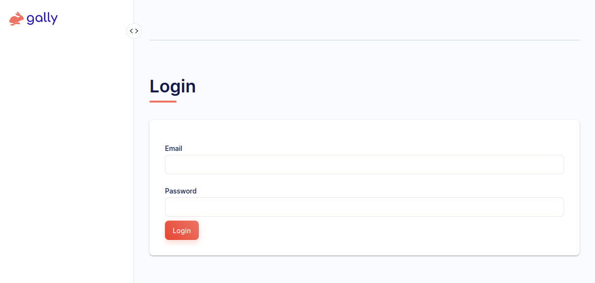
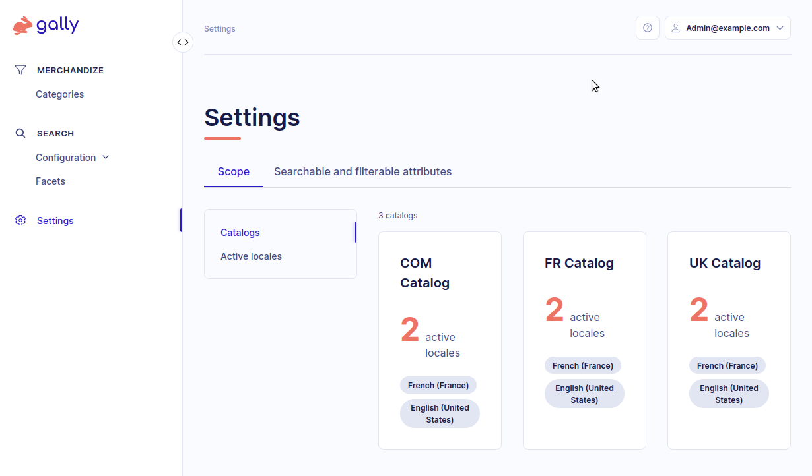
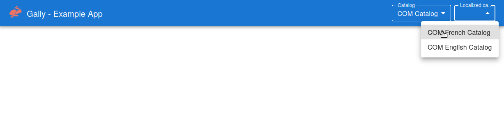
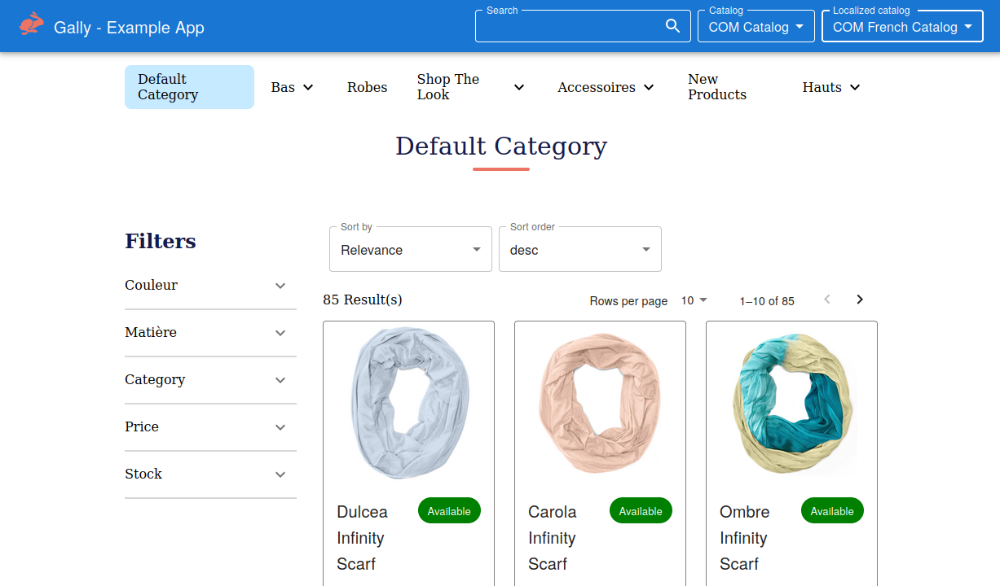
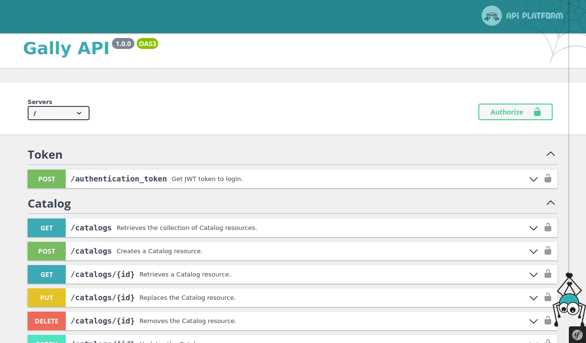
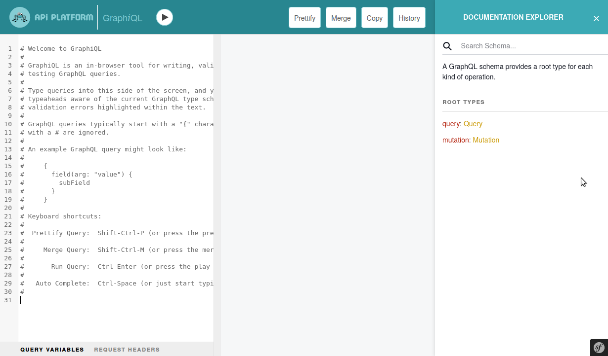

# Requirements
In order to run Gally, you will need:

- Docker (>= 20.10) with the compose plugin
- 2 GB of available RAM/swap for the NodeJs build phase
- 10 GB of free disk space in order to build the docker images
- Disable/Shutdown any local service running on a concurrent exposed port of the application services
  - 5432/tcp : PostgreSQL
  - 80/tcp (HTTP), 443/tcp (HTTPS), 8080/tcp : Apache, Nginx or any HTTP running server
  - 6379/tcp : Redis server
  - 9200/tcp : Elasticsearch

# Run the application with docker on dev environment

1. Fork the repository https://github.com/Elastic-Suite/standalone using “gally” as repository name
2. Clone your repository: git clone git@github.com:USERNAME/gally.git
3. Go in the project directory: cd gally
4. Build and run the application: make up
   This command
   - build the docker images, containers and volumes containers
   - copy the sources into the containers and configure their services
   - build the frontend NodeJS/React application
   - install the Gally database
   
5. Add Gally sample data (catalogs made out of products and categories) : make fixtures_load 
   - answer “yes” to the first question
   - answer “y” to the second question
6.   Create a new admin account with: make sf c=gally:user:create (available roles are “ROLE_ADMIN” and “ROLE_CONTRIBUTOR”)
7.   Wait a few minutes for the frontend application to be build (see I have a blank page on https://localhost/)

# Gally back-office
The back-office of the application should be available at https://localhost/.

The back-office per se is protected by a login screen.

## Gally login screen
Use the credentials defined at the step 6 (“Create a new admin account”) to access it.

<h1 align="center"></h1>

## Gally dashboard

After logging in, the user is redirected to the “Settings” dashboard which displays information about the application data: catalogs and locales which act both as search scopes and product and categories containers.

<h1 align="center"></h1>

# Example frontend application

An example frontend application should be available at https://localhost/example/index.html
It is a frontend application which uses the Gally GraphQL and Rest APIs to provide search and navigation features into the sample data catalogs and categories.

It starts with a mostly blank page besides a “Gally - Example app” header where you can select one of the sample catalog and localized catalog (for instance “COM Catalog” and then “COM French Catalog”).

<h1 align="center"></h1>

Selecting the “COM French Catalog” after having selected the “COM Catalog” catalog.

If the sample data have products for the selected localized catalog, you will be presented by a products list page.

<h1 align="center"></h1>

# Gally swagger

The swagger (Rest API documentation) should be available at https://localhost/docs

<h1 align="center"></h1>

# GraphQL test client
A GraphQL test client should be available at https://localhost/graphql/

<h1 align="center"></h1>

# Run the application with docker on production

1. Deploy the source on your environment
2. Initialize your `.env` file in the project root directory with the variables: UUID, GUID, APP_SECRET, POSTGRES_PASSWORD, APP_ENV
3. Run the application: docker compose -f docker-compose.yml -f docker-compose.prod.yml up -d
4. Install the application: docker compose -f docker-compose.yml -f docker-compose.prod.yml exec php bin/console hautelook:fixtures:load
5. The application should be available from the port 443 of your server
