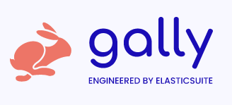

<h1 align="center"></h1>

Meet Gally, the newborn of the Elasticsuite family. If you've been an user of [elasticsuite for Magento](https://github.com/Smile-SA/elasticsuite/), you'll fall in love with Gally as well.

Gally is a next generation Searchandising Engine designed to easily create an API-first E-Commerce Search Engine that can still be customized to fit your needs.

Gally is MACH ready and perfectly designed to use in a Composable Commerce approach.

* Decouple your searchandising engine from your E-Commerce application and use it from several channels. (search from shop, mobile app, E-Commerce website, ...)

* Benefit from our **out-of-the-box data model that is perfectly tailored for E-Commerce** (products, categories, etc...) or extend it to fit you needs.

* Benefit from our **out-of-the-box E-Commerce Searchandising features** : 
  * Capable to deal with several languages per catalog. 
  * Complete management of searchable and filterable attributes of your catalog.
  * Category / Products positioning.
  * Ability to sort products within categories and give them defined positions.
  * Ability to create virtual categories.
  * Ability to create thesaurus & synonyms (incoming)
  * Ability to create boosts on products based on rules (incoming)

* **Expose in minutes a hypermedia REST or a GraphQL API** with pagination, data validation, access control, relation embedding,
  filters and error handling...

* You can **add any additional type of data** (pages, blog posts,...) into Gally and be able to search inside it, thanks to our flexible API.

* Gally uses Elasticsearch, allowing you to benefit from all the power of this technology, but you do not need to understand all the complicated concepts behind it, since they're wrapped nicely by Gally's logic.

* Gally uses [Symfony](https://symfony.com/) and [Api-Platform](https://api-platform.com/), allowing you to extend anything related to the data model or to the features. You'll also benefit of all the API-Platform capabilities : 
  * Design your own data model as plain old PHP classes or [**import an existing one**](https://api-platform.com/docs/schema-generator)
      from the [Schema.org](https://schema.org/) vocabulary.
  * Benefit from Content Negotiation: [GraphQL](https://graphql.org), [JSON-LD](https://json-ld.org), [Hydra](https://hydra-cg.com),
    [HAL](https://github.com/mikekelly/hal_specification/blob/master/hal_specification.md), [JSONAPI](https://jsonapi.org/), [YAML](https://yaml.org/), [JSON](https://www.json.org/), [XML](https://www.w3.org/XML/) and [CSV](https://www.ietf.org/rfc/rfc4180.txt) are supported out of the box.
  * Enjoy the **beautiful automatically generated API documentation** ([Swagger](https://swagger.io/)/[OpenAPI](https://www.openapis.org/)).
  * Create specs and tests with **[a developer friendly API testing tool](https://api-platform.com/docs/distribution/testing/)**.

## Install

[Read our install page](INSTALL.md).

## Credits

Gally is engineered by the [ElasticSuite team](https://elasticsuite.io), part of the Smile-SA group (https://www.smile.eu).

Elasticsearch is a reserved trademark of [Elastic](https://elastic.co)

Api Platform was created by [Kévin Dunglas](https://dunglas.fr).
